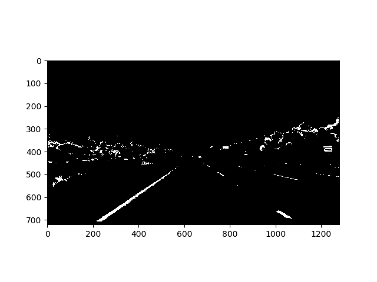
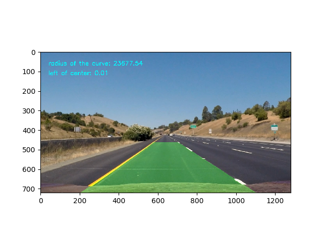

## Advanced Lane Finding
[](http://www.udacity.com/drive)


In this project, your goal is to write a software pipeline to identify the lane boundaries in a video, but the main output or product we want you to create is a detailed writeup of the project.  Check out the [writeup template](https://github.com/udacity/CarND-Advanced-Lane-Lines/blob/master/writeup_template.md) for this project and use it as a starting point for creating your own writeup.  

Creating a great writeup:
---
A great writeup should include the rubric points as well as your description of how you addressed each point.  You should include a detailed description of the code used in each step (with line-number references and code snippets where necessary), and links to other supporting documents or external references.  You should include images in your writeup to demonstrate how your code works with examples.  

All that said, please be concise!  We're not looking for you to write a book here, just a brief description of how you passed each rubric point, and references to the relevant code :). 

You're not required to use markdown for your writeup.  If you use another method please just submit a pdf of your writeup.

The Project
---

The goals / steps of this project are the following:

* Compute the camera calibration matrix and distortion coefficients given a set of chessboard images.
* Apply a distortion correction to raw images.
* Use color transforms, gradients, etc., to create a thresholded binary image.
* Apply a perspective transform to rectify binary image ("birds-eye view").
* Detect lane pixels and fit to find the lane boundary.
* Determine the curvature of the lane and vehicle position with respect to center.
* Warp the detected lane boundaries back onto the original image.
* Output visual display of the lane boundaries and numerical estimation of lane curvature and vehicle position.

### Here I will consider the rubric points individually and describe how I addressed each point in my implementation.  

### Camera Calibration
#### 1. Briefly state how you computed the camera matrix and distortion coefficients. Provide an example of a distortion corrected calibration image.

The code for this step is defined in function ‘camera_calib’.
I start by preparing "object points", which will be the (x, y, z) coordinates of the chessboard corners in the world. Here I am assuming the chessboard is fixed on the (x, y) plane at z=0, such that the object points are the same for each calibration image.  Thus, `objp` is just a replicated array of coordinates, and `objpoints` will be appended with a copy of it every time I successfully detect all chessboard corners in a test image.  `imgpoints` will be appended with the (x, y) pixel position of each of the corners in the image plane with each successful chessboard detection.  
I then used the output `objpoints` and `imgpoints` to compute the camera calibration and distortion coefficients using the `cv2.calibrateCamera()` function.  I applied this distortion correction to the test image using the `cv2.undistort()` function and obtained this result: 


   

The image below depicts the results of applying undistort, using the calibration and distortion coefficients, to one of the chessboard images example

*   orginal image* *undistorted image*

### Pipeline (single images)

#### 1. Example of a distortion-corrected image
To undistort the warped image, I applied “cv2.undistort” from OpenCV and used the coefficients and transformation found from “cv2.calibrateCamera”. The following pictures show the undistorted image results.

  


#### 2. Describe how (and identify where in your code) you used color transforms, gradients or other methods to create a thresholded binary image.  Provide an example of a binary image result.
I defined two individual function for create a binary image for both gradient and color threshold.  “gradient_thresh” function takes the image and apply the gradient based on the different directions or combined input (x, y, magnitude, direction).

  

“color_thresh” function takes the image and convert the image to HLS form. I tested different channel of HLS for different lighting condition.

  

  


After testing for different lighting condition and different scenarios, I concluded that L-channel has the best affect on capturing the white lines while the other filter might pick the other part of the road as a lane. The only drawback of the L-channel is, it fails for capturing the other color like yellow. Therefore, to address this problem I used HSV filter to specifically address the yellow color.

  

Then, I combined the HLS and HLV results for final results.

  

#### 3. Describe how (and identify where in your code) you performed a perspective transform and provide an example of a transformed image.

The code for my perspective transform includes a function called `perspective()’. The ` perspective()` function takes as inputs an image (`img`), as well as source (`src`) and destination (`dst`) points.  I chose the hardcode the source and destination 

```python
dst = np.float32([[offsetx,offsety],
		[offsetx, img.shape[0]-offsety], 
		[img.shape[1]-offsetx, img.shape[0]-offsety], 
		[img.shape[1]-offsetx, offsety]])
src = np.float32([[img.shape[1]/2.22, img.shape[0]/1.55],
		[img.shape[1]/4.96, img.shape[0]/1.055],
		[img.shape[1]/1.22, img.shape[0]/1.055], 
		[img.shape[1]/1.81, img.shape[0]/1.55]]) 
```
Where 
offsetx = 300
offsety = 20

I verified that my perspective transform was working as expected by drawing the `src` and `dst` points onto a test image and its warped counterpart to verify that the lines appear parallel in the warped image.


  

#### 4. Describe how (and identify where in your code) you identified lane-line pixels and fit their positions with a polynomial?
Then I did some other stuff and fit my lane lines with a 2nd order polynomial kinda like this:
This process includes using the histogram to find the left and right lanes in the picture and then using sliding technique to create small windows enclosing the maximum pixel of the lanes such that the concentration of the pixel occurs at the middle of each window. Then create the data points from the pixel coordinates in all the sliding windows. After extracting the data points, I applied the polyfit function to generate a fit a second order polynomial on the data points. The results of the process are shown below.


Next, in order to avoid calculating the sliding windows each time, I tried to narrow down the search area around the lane found in the last frame. This will help for computation time. There is a check in each iteration to make sure that the lane can be detected in the boundary, if it fails to find the lane in the boundary, it will try the sliding windows the technique again.


#### 5. Describe how (and identify where in your code) you calculated the radius of curvature of the lane and the position of the vehicle with respect to center.
I defined a function `measure_curvature_pixels` to measure the curvature of the each lane line according to the following equation:
R_cuve=[(1+(2Ay+B)^2)]^(3⁄2)/|2A| 
Where A and B are coefficients of a quadratic equation
f(y)=Ay^2+By+C
The y is the values of the image increase from top to bottom. In this equation I selected the maximum value of the y which occurs at the bottom of the image where the lines start.
Therefore, the radius of the curve is the average of left and right lines.
I also calculated the position of the center of the car with respect to the center of the lanes.

left_fit_poly = left_fit[0]*yMax**2 + left_fit[1]*yMax + left_fit[2]

right_fit_poly = right_fit[0]*yMax**2 + right_fit[1]*yMax + right_fit[2]

mid_fit_poly = (left_fit_poly+right_fit_poly)/2

car_center = (img_size[1]/2)*xm_per_pix

car_pos_wrt_lane = car_center - mid_fit_poly


#### 6. Provide an example image of your result plotted back down onto the road such that the lane area is identified clearly.

I implemented this step in function “project_lane_line”. Here is an example of my result on a test image:



### Pipeline (video)

#### 1. Provide a link to your final video output.  Your pipeline should perform reasonably well on the entire project video (wobbly lines are ok but no catastrophic failures that would cause the car to drive off the road!).

Here's a [link to my video result](test_video_output/videos/project_video.avi)


### Discussion

#### 1. Briefly discuss any problems / issues you faced in your implementation of this project.  Where will your pipeline likely fail?  What could you do to make it more robust?

The pipelines is tested for different pictures and videos and is working for normal conditions. However, seems like lane detection depends on lighting condition, shadows and the color of the lane lines. In order to address this problem, I used the combined color threshold of HLS and HLV and turned off the gradient threshold. I also added smooth function to make sure that the lane lines the lane line are not missing. These features improved the lane line detection significantly, however, it is not very stable yet. That means, in a very bright condition the line fails to be detected. 
Furthermore, if one side of lane marking is missing that can cause the problem. 
